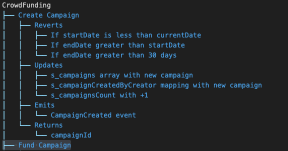
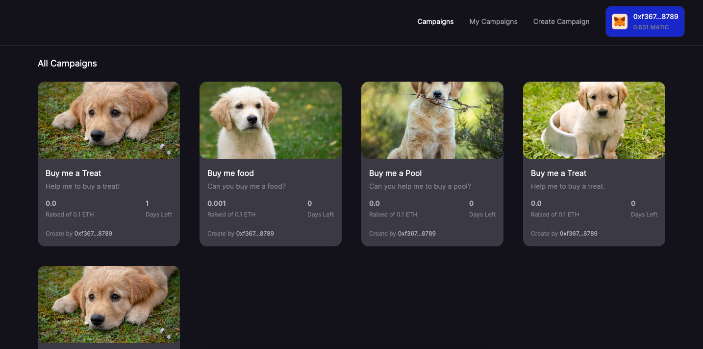
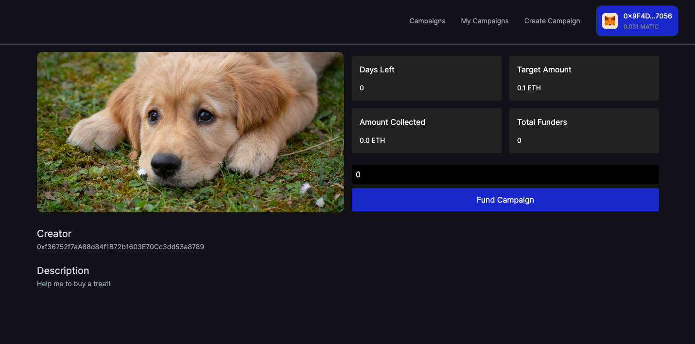
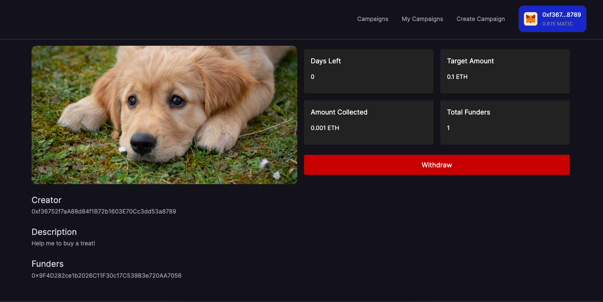
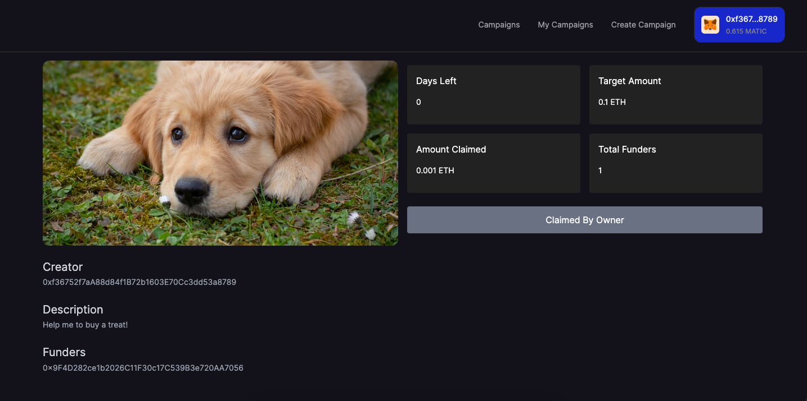

# CrowdFunding

## About

This application allows users to create fundraising campaigns, and other participants can contribute funds to support these campaigns. Once a campaign reaches its deadline, the creator can withdraw the accumulated funds.

## Workflow



-   [Checkout the complete worflow](./test/CrowdFunding.tree)

## Test

```sh
forge test
```

| File                            | % Lines         | % Statements    | % Branches      | % Funcs       |
| ------------------------------- | --------------- | --------------- | --------------- | ------------- |
| script/DeployCrowdFunding.s.sol | 100.00% (4/4)   | 100.00% (5/5)   | 100.00% (0/0)   | 100.00% (1/1) |
| src/CrowdFunding.sol            | 100.00% (58/58) | 100.00% (64/64) | 100.00% (26/26) | 100.00% (9/9) |

or

```sh
forge test --rpc-url <RPC_URL>
```

## Deployment

-   To deploy to Anvil
-   Start the anvil chain

```sh
make deployToAnvil
```

or

## Deployment to a testnet or mainnet

1. Setup environment variables

-   You'll want to set your `SEPOLIA_RPC_URL` in environment variables. You can add them to a `.env` file, similar to what you see in `.env.example`.

2. Use wallet options to Encrypt Private Keys

-   [Private Key Encryption](https://github.com/allwin199/foundry-fundamendals/blob/main/DeploymentDetails.md)

Optionally, add your `ETHERSCAN_API_KEY` if you want to verify your contract on [Etherscan](https://etherscan.io/).

### Get testnet ETH

Head over to [faucets.chain.link](https://faucets.chain.link/) and get some testnet ETH. You should see the ETH show up in your metamask.

### Deploy

```sh
make deployToSepolia
```

---

## Demo

[CrowdFunding Nextjs App](https://crowdfunding-frontend-allwin.vercel.app/)  
[Github](https://github.com/allwin199/crowdfunding-frontend)

### Home



---

### Fund



---

### Withdraw



---

### Owner Claimed



# ThankYou :)
